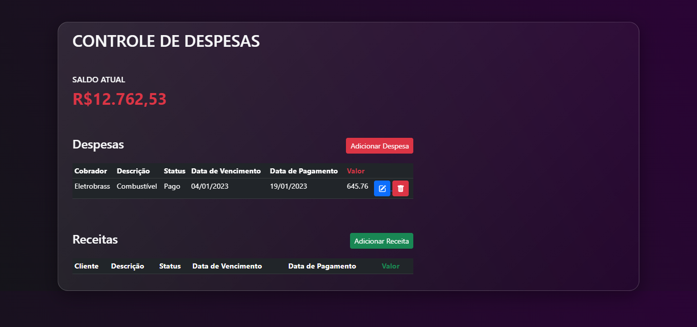
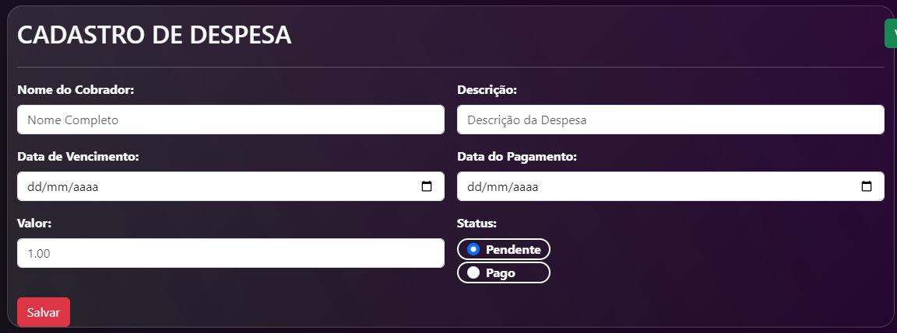
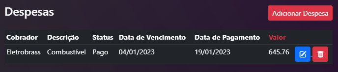
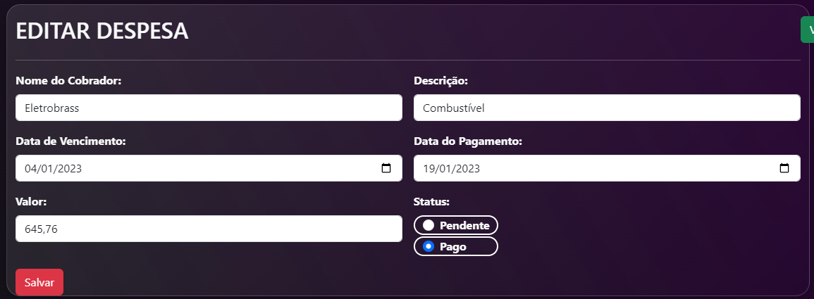

# Controle Financeiro

Projeto desenvolvido para teste de CRUD em um banco de dados (MySql) e uma [Api](https://63d04fc0e52f587829afcc9f.mockapi.io/receitas), utilizando como linguagem principal o PHP.

## CRUD Despesas

  

### CREATE

  

### READ

  

### UPDATE

  

### DELETE

  

 

## CRUD Receitas
- Em breve

## 🚀 Tecnologias

Esse projeto foi desenvolvido com as seguintes tecnologias:

 | PHP 

 | <a href="https://getbootstrap.com/">Composer</a>

 | <a href="https://getbootstrap.com/">Bootstrap</a>

  
  
  

